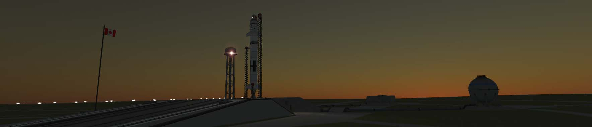

An Iris rocket configured for a crewed launch prepares for launch

## Description

Iris is a two-stage-to-orbit medium-lift launch vehicle, designed primarily to launch payloads into low Kerbal orbit or to a geostationary transfer orbit. It is inspired by the SpaceX [Falcon 9](https://en.wikipedia.org/wiki/Falcon_9). The booster conceivably has the ability to return and land via parachute or its own propulsion, although this is not normally possible since Kerbal Space Program only allows a user to control one rocket at a time.