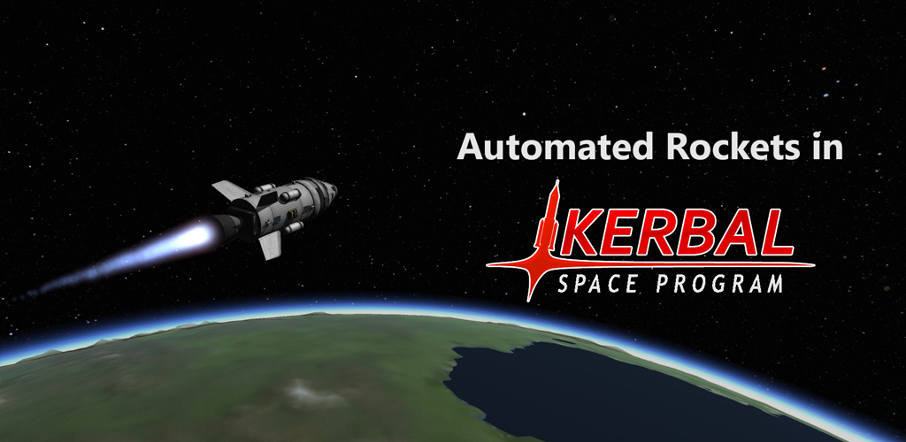

## Description

A series of scripts used to automate launching various rockets in Kerbal Space Program using the [Remote Procedure Call Server mod](https://krpc.github.io/krpc/index.html) for the game. These scripts are primarily written in Python, although I may use additional languages where I'd like to (C#, C++, Java, Lua, and Python are all usable with this mod).

My scripts are sorted based on the launch vehicle for which they are developed. For example, the Iris Rocket's crewed launch and satellite constellation launch scripts are both in the Iris Rocket folder since they use the same base vehicle.

Note that the scripts come at different points in my learning of the mod, so some may not be perfected or ideal (they all likely waste fuel!), however all of the scripts are able to accomplish the main objectives I prepared them for.

## How to Use

Assuming Python has already been installed, run the command `pip install krpc` to install the required library.

Download the mod from its [KSP Forum Post](https://forum.kerbalspaceprogram.com/index.php?/topic/130742-15x-to-122-krpc-control-the-game-using-c-c-java-lua-python-ruby-haskell-c-arduino-v048-28th-october-2018/) and copy the contents of the GameData folder into the GameData folder of Kerbal Space Program. Ensure to downgrade KSP to an older version if needed.

Finally, design a vehicle similar to the script they're designed for and simply run the script.